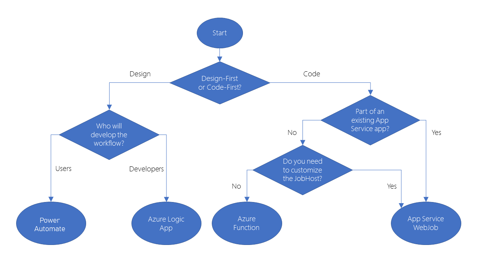
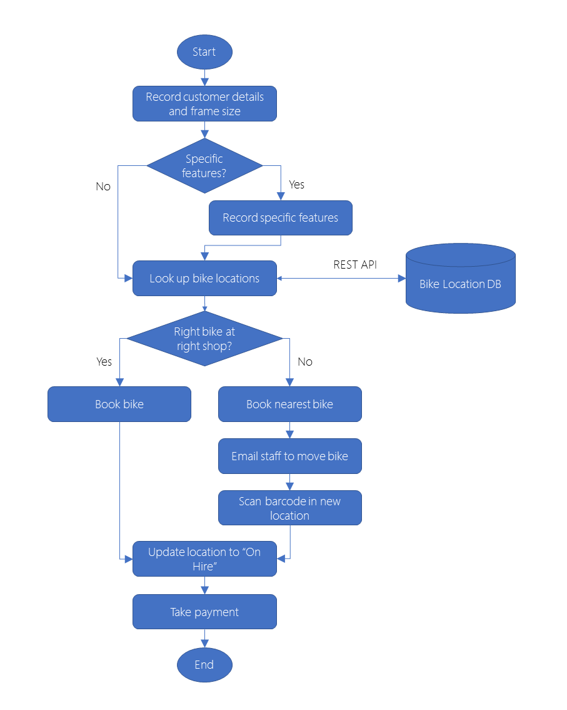

# Introduction - AP 204 Cert

Bike rental system
- Bike tracking.
- Rental scheme.
- Inventory management

Microsoft has:
- Logic Apps
- Microsoft Power Automate
- WebJobs
- Azure Functions

Design-first technologies in Azure
- Logic Apps: automate distributed apps
- Power Automate: Create workflows.`

Code-first technologies in Azure
- WebJobs and the WebJobs SDK
- Azure Functions

